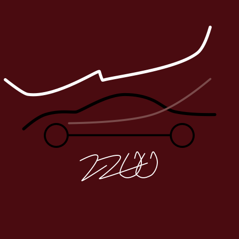

先在文章的开头把这篇文章的主要准则「不谈技术」再重申一遍。所以，该篇文章不会出现任何技术名词！

## 关于命名
至少在写这篇文章的时候，我是把这个网站当作我的个人博客的，算是一个除了朋友圈（虽然我不怎么发朋友圈）、微博（微博受限于篇幅不能叨叨太多）之外的第三主力战场了。

首先，`走走游游` 是我的全网昵称，这个昵称大概用了十几年了吧，曾经有人评论我说「我和我的昵称特别像」，我也渐渐的觉得我越来越像了，早知道这样应该起名叫「有有钱钱」或者「🐂🐂🍺🍺」(不知道 Windows 系统下对 emoji 表情的支持情况怎么样...)。

其次，`走走游游` 确实是也是我的一个理想，关于这个理想的解释，后面再补充吧。

所以，`不如走走游游` 既可以是 `不如我` 的意思，也可以是一种 `不如跳舞` 的洒脱。

妙啊！

其实更多的还是后者，因为当时起名的瞬间想的是 `写代码不如走走游游`。 🤷‍♂️

## 关于 LOGO

上张大图吧，在导航栏上的小 logo 总是有种中间内容没对齐的感觉。

> 「灵感时间」你的第一眼，觉得 logo 像什么？

3 ...

2 ...

1 ...

这是我三四年前开始背的，目前还背着的，收到的表扬要比我还多的包...

既然网站的命名叫 `不如走走游游`，再加我是一个及其不愿意拖着行李箱出门的人，就想到了拿我的包当作 logo 吧。

行李箱见鬼去吧！尤其是那种大的可以装下和谐的那种！

## 关于动机
｡◕‿◕｡ 直白一点，积累工作经验，面试用的。